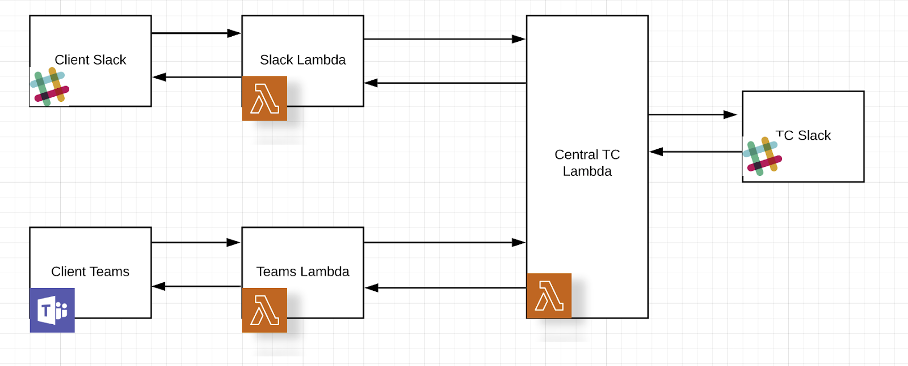

# Topbot - Slack Lambda

## Overview

Slack lambda acts as a bridge between Client Slack and TC Central lambda

## Deployment Guide

Follow instructions in [Deployment Guide](docs/DeploymentGuide.md)

## Verification Guide

Follow instructions in [Verification Guide](docs/VerificationGuide.md)

## Swagger documentation

REST API's are documented in [swagger.yaml](docs/swagger/swagger.yaml)

## DynamoDB database description

Database has one table `projects` with the following fields,

`id` (primary_key): Unique id for each project

`description`: Project description

`requester`: The name of the client user who initiates project request

`createdAt`: Timestamp at which the project was created

`status`: Current status of the project. It is one of LAUNCHED, RESPONDED, ACCEPTED, DECLINED or APPROVED. 

Why we need it: To handle scenarios like multiple clicks on buttons.

`clientSlackThread` (has an index - `client_slack_thread_index`): The thread id in client slack where the @topbot request command was initially invoked.

`clientSlackChannel`: The channel in client slack where the @topbot request command was initially invoked. The client can invoked this command in any channel so the combination of clientSlackThread and clientSlackChannel uniquely identify a request thread.

Why we need it: `clientSlackThread` and `clientSlackChannel`: These fields are used by Slack lambda to identify the project when an `email` command is issued. Without these fields we'd have no context of which thread to post responses to.

`tcSlackThread`: Thread id in topcoder slack where the project request was initially posted by TC Central.

Why we need it: This is used to post messages to TC Slack when routes `/accept` or `/decline` or `/invite` is called. Also used during dialog submission. Without it we'd have no context of which thread to post responses to.
There is no need to store tcSlackChannel as it is fixed.

`teamsConversationId`: Conversation id in MS Teams where the @topbot request command was initially invoked. Conversation id is a combination of channel id and message id so we don't need an additional teams field to store channel information (like `clientSlackChannel`)

Why we need it: This field is used by Teams lambda to identify the project when an `email` command is issued. Without this field we'd have no way to identify which conversation to post responses to.

`platform`: Supported messageing platforms. Currently it can be either `slack` or `teams`. It is used to differentiate requests from Client Slack and Client MS Teams.

## Known issues

You might see duplicate acknowledgement messages in Slack when issuing email invites.

The reason is that Slack expects a response within 3 seconds but since we're using lambda we can only return from a function after all our operations complete

So if we don't respond within 3 seconds, then Slack posts a duplicate event for the same command.

From docs, 

"Your app should respond to the event request with an HTTP 2xx within three seconds. If it does not, we'll consider the event delivery attempt failed. After a failure, we'll retry three times, backing off exponentially."

The solution seems to be to have one lambda function call another using something like AWS SNS

See https://stackoverflow.com/questions/31714788/can-an-aws-lambda-function-call-another