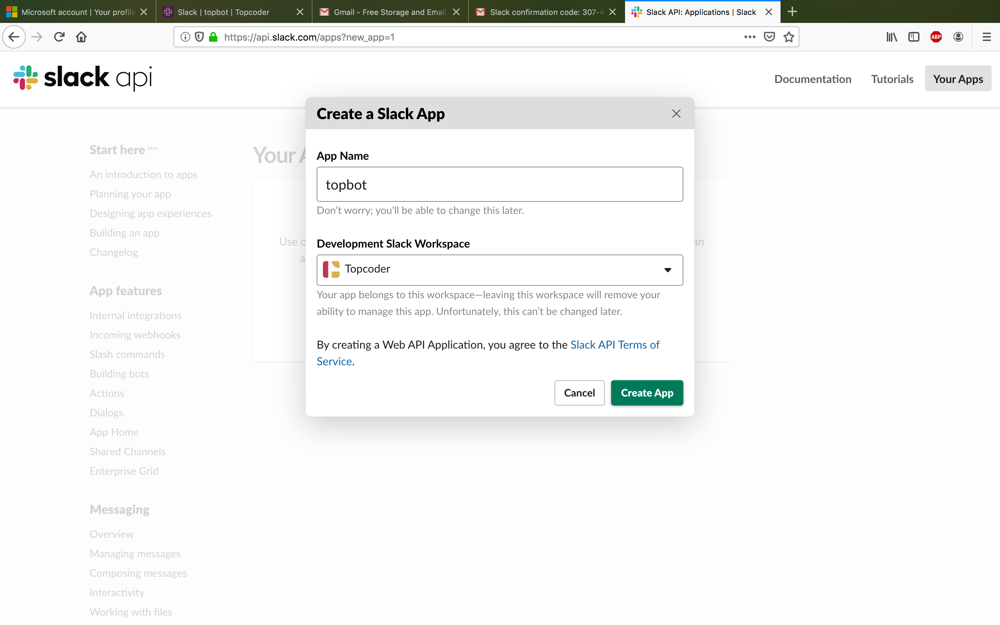

# Deployment Guide

## Prerequisites

1. Node.js >= v12.14.1

2. ngrok: https://ngrok.com/download

3. localstack: https://github.com/localstack/localstack

## AWS Services

Slack lambda uses Dynamodb to store/retrieve data and listens to SNS topics to obtain events from Topbot - Receiver.

Both these services can be run locally using localstack.

1. Start the localstack server, `localstack start`.You will obtain a port number for dynamodb and sns.

2. **ENV** Update `provider:environment:DYNAMODB_ENDPOINT` field in `serverless.yml` with the dynamodb port,
    ```
      environment:
        # AWS configuration
        AWS_ACCESS_KEY_ID: FAKE_ACCESS_KEY_ID
        AWS_SECRET_ACCESS_KEY: FAKE_SECRET_ACCESS_KEY
        AWS_REGION: FAKE_REGION
        DYNAMODB_ENDPOINT: http://localhost:4569 # This value
    ```

3. **ENV** Update `custom:serverless-offline-sns:sns-endpoint` field in `serverless.yml` with the sns port,
    ```
    serverless-offline-sns:
        port: 4001
        debug: false
        sns-endpoint: http://localhost:4575 # This value
    ```

Update `provider:environment:SNS_ENDPOINT` with this value.

The other sns config values can be set the same unless you explicitly change it in sns.

4. [Optional] You can view the contents of dynamodb in your browser using a tool like [dynamodb-admin](https://www.npmjs.com/package/dynamodb-admin)

##  TC Central Setup

In order to deploy Slack lambda, you will need to first deply TC Central. The Slack account created there will represent Topcoder slack. You will then need to create an app in that workspace. This app will then be installed by clients in their workspaces.

## Create an app in Topcoder slack account

1. Open the create app page, click [here](https://api.slack.com/apps?new_app=1)

2. Provide a name and select a workspace (This represents the Topcoder workspace)



3. **ENV** Go to app credentials from `Settings` -> `Basic Information`. 
Update `serverless.yml` with the the values,
Client id -> `provider:environment:CLIENT_ID` (**Make sure to use quotes around CLIENT_ID**)
Client secret -> `provider:environment:CLIENT_SECRET`
`Signing Secret` -> `provider:environment:CLIENT_SIGNING_SECRET` 


4. Click on `Features` -> `Bot users` -> `Add a Bot User`. Provide a name say, `topbot` and click `Add Bot User`


5. Click on `Features` -> `OAuth & Permissions`, go to `Scopes` -> `Select Permission Scopes` -> Add scope `bot`, `channels:write` and `users:read` and click `Save changes`.


**Do not install the app into workspace. This app is meant to be installed in client workspace and not Topcoder workspace.**

9. **ENV** Slack lambda needs to communicate with TC Central lambda. Set the URI of TC Central lambda in the `provider:environment:CENTRAL_LAMBDA_URI` field in `serverless.yml`. If you haven't already deployed TC Central lambda, you can deploy it at this port later after Slack lambda is deployed. 
    
 By default, TC Central lambda runs on port 3000. So if you are using defaults, you don't need to change this field.

10. `serverless.yml` should look something like,
    ```
    service: slack_lambda

    provider:
    name: aws
    runtime: nodejs10.x

    environment:
        # AWS configuration
        AWS_ACCESS_KEY_ID: FAKE_ACCESS_KEY_ID
        AWS_SECRET_ACCESS_KEY: FAKE_SECRET_ACCESS_KEY
        AWS_REGION: FAKE_REGION
        DYNAMODB_ENDPOINT: http://localhost:8000

        # Client Slack bot configuration
        CLIENT_ID: '751151625041.751156216241'
        CLIENT_SECRET: f4adf8e2b83ac725cfdd7bfe3cc6941c
        CLIENT_SIGNING_SECRET: 52810ea6b0cf1e67b2861be8bddce102
        ADD_TO_SLACK_BUTTON: '<a href="https://slack.com/oauth/authorize?client_id=751151625041.751156216241&scope=bot,channels:write,users:read"></a>'
        
        # Central TC Lambda URI
        CENTRAL_LAMBDA_URI: 'http://localhost:3000'

        # Token encryption/decryption key
        CRYPTO_KEY: '3i)!Pf#"kq-)C[;UN-AVQ/doOk,[24'
    ```

## Start Slack lambda server

1. Install `serverless` globally. `npm i -g serverless`

2. In the `slack-lambda` directory run `npm i` to install required modules

3. [Optional] Check for lint errors by running `npm run lint`. Fix any errors by running `npm run lint:fix`

4. In the `slack-lambda` directory run `serverless offline` to start the Serverless API gateway on port 3001. The gateway runs the lambda functions on demand.

5. You should see that the SNS topics, `client-slack-events` and `client-slack-interactive` are created. You can verify this using the aws cli,
`aws --endpoint-url=http://localhost:4575 sns list-topics`

6. Expose the server using `ngrok`. Run `ngrok http 3001`. You will obtain a url like `https://9bb718af.au.ngrok.io`. Note down this value. I will refer to it as `NGROK_URL`.


**NOTE on ngrok** 

If you are using a free version of ngrok, it allows only one simultaneous connection. This is a problem if you want to run both Slack lambda and TC Central and expose both using ngrok. 

The solution is to use the `--region` field while starting ngrok. So, if you're already running ngrok, you will see a region such as `Region United States (us)` in the terminal.
To start another ngrok session just choose another region to run in by executing `ngrok http 3001 --region au`. This will start ngrok in `Region Australia (au)`

## Enable event subscriptions in Slack app

1. Go to https://api.slack.com/apps and click on the app that you created earlier in `Create a Slack App`

2. Click on `Features` -> `Event Subscriptions`. Turn it on.

3. Go to `Subscribe to Bot Events` section and add `app_mention` event. (See the image below)

4. Scroll up and provide a `Request URL`. Provide value `NGROK_URL/slack/events` and click `Save changes` once verified.


## Enable interactive components in Slack app

1. Go to https://api.slack.com/apps and click on the app that you created earlier in `Create a Slack App`

2. Click on `Features` -> `Interactive Components`. Turn it on and fill in `NGROK_URL/slack/interactive` into the `Request URL` field. Click Save changes.


## Provide redirect url

1. Click on `Features` -> `OAuth & Permissions`, go to `Redirect URL's` -> `Add new redirect url`, provide value `NGROK_URL/auth/redirect` and click save.


## Make app distributable publicly

1. Go to https://api.slack.com/apps and click on the app that you created earlier in `Create a Slack App`

2. Click on `Settings` -> `Manage distribution`. 
Check `Remove Hard Coded Information`. The `Activate Public Distribution` button should now become enabled. Click it.


3. **ENV** Copy the html code provided in the Embeddable Slack Button box and paste it into `serverless.yml` -> `provider:environment:ADD_TO_SLACK_BUTTON`.


**Restart server for the ADD_TO_SLACK_BUTTON env variable to take effect**

## Create Client workspace

### Create a free Slack account

1. Create a slack account if you don't have one already. Click `Create a new workspace` [here](https://slack.com/get-started).

2. Provide an email address and click confirm

3. A verification code will be sent to your email, post the verification code back to the slack setup page

4. Create a team and a project

5. Click `Skip for now` if you don't want to add more users


6. You should see your team and your channel created


### Install slack lambda to client workspace

1. While logged in to client workspace account, open url `NGROK_URL/signin`. You should see th Add to Slack button.


2. Click the button, click "Allow" to install the bot to client workspace


3. On success, you will see a success message,


### Setup slack channel

1. Invite the bot user `/invite @topbot` to any channel from which you want to create project requests

## Setup TC Central lambda

1. If you haven't already done it, then setup TC Central lambda by following its `DeploymentGuide.md` before moving on to [Verification Guide](./VerificationGuide.md). Note that if you change the port of TC Central lambda, then you need to update `provider:environment:CENTRAL_LAMBDA_URI` field in `serverless.yml` **and restart** Slack lambda.